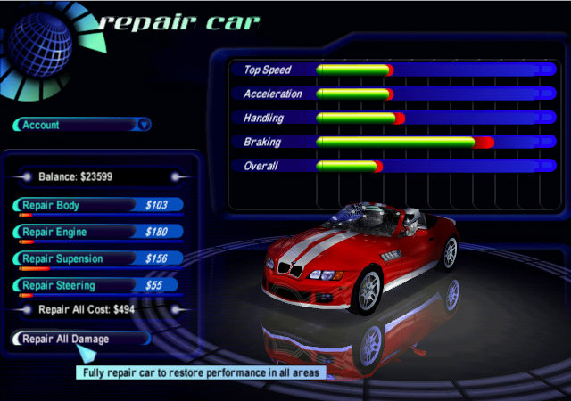

Каждый раз, когда болею, задумываюсь о медицине — о том, как плохо с ней сейчас в Украине, как это можно потихоньку улучшать, а также мечтаю о том, как все может быть в будущем, глобально.

По сравнению с другими отраслями, медицина  у нас развивается невообразимо медленно. Я вижу в этом такие причины:

**Низкокачественный спрос.** У нас толком отсутствует культура ухода за своим здоровьем. Когда человек болеет, он редко идет к врачу. Какие лекарства ему принимать, он знает — во-первых, есть собственный опыт и рекомендации знакомых и родных, а во-вторых реклама самых разных лекарств едва ли не от всех болезней по телевизору — и рекламы такой очень много, на глаз процентов 30-40 (еще столько же рекламного времени занимают ролики про алкоголь).

Это очень плохо по очевидным причинам. Больной может неправильно постановить себе диагноз, лечить последствия заболевания вместо причины, или не лечиться вовсе — «пройдёт». А еще можно употреблять гомеопатию или просто какую-то разрекламированную бесполезную ерунду.

**Плохие поликлиники и больницы.** «Бесплатная» медицина себя изжила. Даже если государство пытается что-то модернизировать, врачи уже привыкли к тому, чтобы требовать деньги «в фонд кабинета» или «за плёночку». Никаких «бесплатных лекарств» на практике тоже нет — однажды, когда отец попал в больницу с аллергией по скорой, мне пришлось поздней ночью искать в неблагополучном районе круглосуточную аптеку, чтобы купить не самые хитрые лекарства и систему для капельницы.

**Трудный доступ к врачам.** Большинство врачей, которым я доверяю, пройдя через свою поликлинику и несколько частных, — те, которых когда-то посоветовали друзья или родственники. Они обычно работают в государственных клиниках, но к ним можно записаться на полуофициальный прием по телефону. Очевидно, что это крайне неэффективно. Кроме того, еще действует страшно совковая система направлений: я не могу прийти к определенному специалисту в городскую или областную больницу, мне нужно сначала получить направление от терапевта по месту прописки. Если я хочу пойти на консультацию к ревматологу, зачем мне стоять в очереди с больными людьми, чтобы получить бесполезный листок бумаги? Привязка к месту прописки — тоже та еще бюрократическая глупость; пора принять тот факт, что люди часто не живут там, где прописаны.

Нагромождение таких барьеров создает ту проблему, что пациент с чем-то несрочным просто откладывает свой визит к врачу на неопределенный срок, и из-за этого может запустить болезнь. Обвинять в этом только пациента некорректно — медицинская индустрия должна, наконец, понять, что время своих клиентов тоже следует уважать.

**Недоверие к врачам.** Врачи часто ошибаются случайно или намеренно. [дописать]

Будущее
-------

**Хорошие государственные и частные клиники.** ??? В государственных клиниках будет нормальная запись по времени, никаких взяток и сюрпризов. Они смогут привлекать ???

**Информативная электронная карточка.** У каждого человека должна быть карточка, которая не потеряется, и на изучение которой врачу нужен будет минимум времени. Врач тут же увидит все сделанные и не сделанные прививки, аллергию на препараты, перенесенные болезни.

**Строжайший контроль качества.** Врач — профессия, требующая невероятно высокой ответственности. Каждый врач должен любить свою работу и делать ее хорошо. Врачам нужно подтверждать свои знания и постоянно учиться. [ред + дописать]

Врач, уличенный на вымогательстве или превышении полномочий должен быть серьезно оштрафован.

**Адекватный мониторинг состояния организма.**
Лет 15 назад я играл в четвертую часть игры Need For Speed. После гонки можно было прийти в гараж и посмотреть, какие части автомобиля повреждены, в какой мере. Их можно было в один клик починить:

<figure>
  
</figure>

Будет здорово, когда человек сможет легко увидеть картинку или сводную таблицу о состоянии своих внутренних органов, и получить  рекомендации, что ему с этим делать. Кому-то назначат операцию или курс таблеток, а кому-то нужно будет есть больше или меньше определенной еды.

Насколько я знаю, государство предлагает населению раз в год сдавать только флюорографию. Но я думаю, было бы неплохо иметь расширенный пакет обследований/анализов, которые можно будет проходить по желанию, но с хорошей скидкой. Анализы можно будет сдать за 15 минут, врачей можно будет обойти одной цепочкой без очереди. Врачи при этом должны себя вести не как на медкомиссии («Следующий»), но внимательно изучать каждого пациента.

**Более подробные анализы.**
Было бы здорово при проведении общих анализов крови/урогенитального материала проверять, не болеет ли человек определенными болезнями, используя при этом тот же объем взятого материала. Так можно немного сдвинуть с места проблему поздней диагностики серьезных заболеваний. Этому должен поспособствовать прогресс — это не должно сильно удорожать стоимость анализов.

**Эффективные лекарства с минимумом вреда.**
Медицина будущего сможет аргументированно подсказывать врачу, какие лекарства стоит назначить пациенту. Риск возникновения побочных эффектов сможет быть максимально точно определен для конкретного больного.

Споры о вреде прививок будут закончены. Каждая вакцина будет безопасна для того, кому она показана.

**Конец болезням, которые нужно лечить за границей за космические деньги.**
Болезнь такая-то, смертельная. Стадия запущенная. Лечение только за границей, в Германии или в Израиле. Стоимость лечения $250 000. Версий, почему такая данность встречается повсеместно, много, им можно найти оправдание. Но почти никто не застрахован от аналогичной ситуации, а четверть миллиона долларов смогут найти не все. Я искренне надеюсь, что люди в этом мире смогут эту проблему решить как можно скорее. И пусть эта болезнь исчезнет, как оспа лишь через неопределенное время, но стоимость лечения наверняка может значительно подешеветь в более обозримом будущем, а диагностировать эту болезнь можно будет до того, когда ее лечение будет столько стоить.

Какие у вас есть претензии к медицине в своей стране и в мире? Какой вы видите медицину будущего?